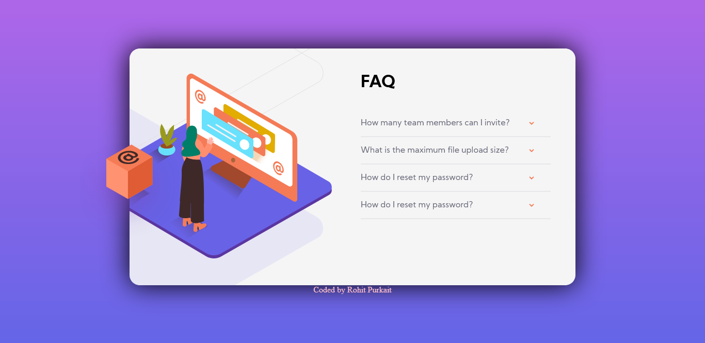

# FAQ Accordion Card 

<h2 style="color:violet">The Website</h2>

<h2 style="color:violet">Link To My Website</h2>

> <a href="https://codeswithroh.github.io/" style="color:pink; font-weight:bold">FAQ-card</a>

<h2 style="color:violet"> Author </h2>

> <a href="https://codeswithroh.github.io/" style="color:pink; font-weight:bold">ROHIT PURKAIT</a>
